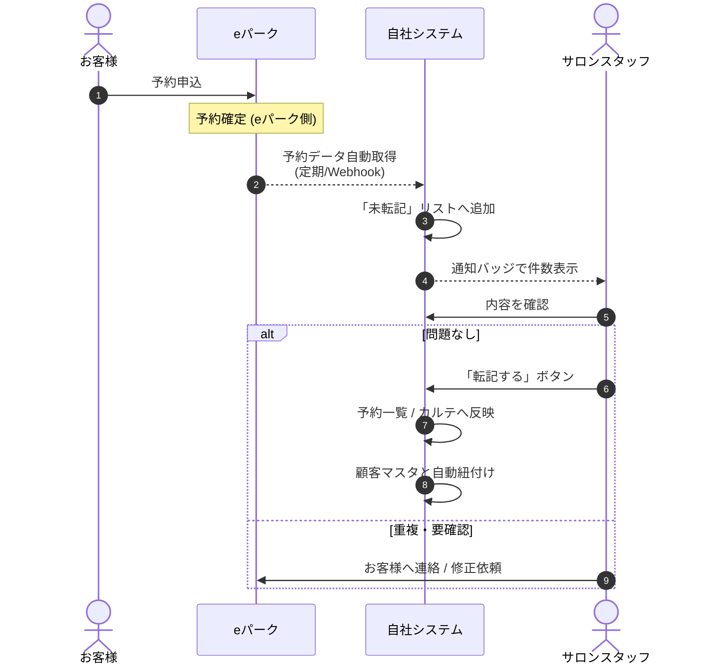
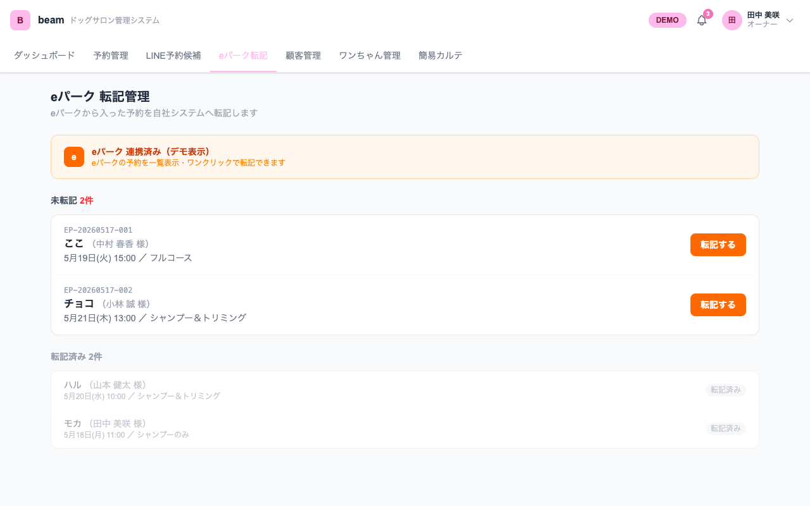

# eパーク 転記管理 — 連携仕様書

> **対象**: ドッグサロン業種テンプレート（demo-builder）
> **用途**: 商談・クライアント説明用
> **デモURL**: https://demo-builder-coral.vercel.app/demo/dogsalon_beam/epark

---

## 1. このページでできること（一行要約）

**eパーク経由で入った予約を「自社の予約管理」にワンクリックで取り込む。**

---

## 2. なぜ必要か（クライアントへの説明）

ペット業界では多くのサロンが「eパーク」「ペットライン」などの**予約プラットフォーム**を併用している。
これらは集客に有効だが、予約データが**自社システムと分断**されているため次の問題が起こる。

- eパークの画面と自社管理ノートを**両方見ないと予約全体が把握できない**
- 同じ顧客がeパークと電話で重複予約しても気づきにくい
- スタッフが**手書きで転記**しているため、書き漏れ・時間違いが発生する
- eパークの予約は**自動的にカルテと紐付かない**ため、来店履歴が分断される

→ **eパーク 転記管理**は、これらをまとめて解決する。

---

## 3. データフロー

### ポイント

| 項目 | 内容 |
|------|------|
| **取込頻度** | 標準: 1日数回の自動同期 ／ オプション: Webhook によるリアルタイム取込 |
| **転記タイミング** | スタッフが内容を確認してから手動で「転記」（誤データ・重複を防ぐため） |
| **顧客紐付け** | 電話番号・氏名カナで自動マッチ。新規顧客は転記時に自動登録 |
| **重複検出** | 同一日時・同一顧客の予約があると警告表示（標準） |

---

## 4. 画面サンプル

### 画面の構成

| 領域 | 役割 |
|------|------|
| **連携ステータスバナー（オレンジ）** | eパーク連携の稼働状態を表示 |
| **未転記**（赤バッジ） | まだ自社システムに取り込まれていない予約 |
| **「転記する」ボタン** | 1クリックで自社の予約一覧へ反映 |
| **転記済み**（下部） | 過去の取込実績 |

### 取り込まれる情報

- eパーク予約ID（例: `EP-20260519-001`）
- 予約日・予約時刻
- お客様名・ワンちゃん名
- メニュー（シャンプー＆トリミング 等）

---

## 5. ユースケース（業務例）

### ユースケース A: 朝の確認ルーチン

> **9:00** スタッフが出勤
> ダッシュボードを開くと「eパーク未転記 2件」のバッジ
> 内容を確認して「転記」→ 予約一覧の本日分が3件→5件に増える
> → 当日の段取り判断が完結する

### ユースケース B: 重複予約の検知

> お客様が**電話**と**eパーク**の両方で同じ日に予約
> 自社システム側は電話予約を先に登録済み
> eパーク取込時に「⚠ 同日同時刻に既存予約あり」と表示
> → スタッフがお客様に連絡してどちらか取消

### ユースケース C: 月次の集客チャネル分析

> 月末にダッシュボードの「予約経路ランキング」を確認
> 全予約 120件のうち
>  - eパーク: 45件
>  - LINE: 30件
>  - 電話: 28件
>  - 窓口: 17件
> → 集客への投資判断（広告・SNS）に活用

---

## 6. 設定例（導入の流れ）

### 1) eパーク管理画面で API キーを発行
事業者ページにログイン → 「外部連携」→ API キーを発行（読取権限）

### 2) demo-builder 管理画面で連携情報を登録
- API キー
- 取込頻度（標準: 30分ごと / Webhook 対応の場合: リアルタイム）
- 顧客紐付けのキー（電話番号 or メール）

### 3) テスト取込
- テスト予約を1件作成 → 「未転記」リストに表示されることを確認
- 「転記する」→ 予約一覧に反映されることを確認

### 4) スタッフ運用ルール策定
- 確認担当者（開店時 / 閉店時 など）
- 重複検知時のフロー（誰がお客様に連絡するか）

---

## 7. できること / できないこと

| ✅ 標準で可能 | ⚠ オプション / カスタム |
|---------------|----------------------|
| eパーク予約の自動取込 | eパーク管理画面へ自動的に「キャンセル」「変更」を**書き戻す**（一方向のみ標準） |
| 未転記の一覧表示と件数バッジ | リアルタイム Webhook 取込（標準は定期同期） |
| 重複検知・警告表示 | eパーク以外の他社プラットフォーム（ペットライン等）の同時連携 |
| 顧客の自動紐付け | 自動転記（全件無条件で取込） |
| 転記済みの履歴管理 | 取込メールでスタッフへ通知 |

---

## 8. 運用上の注意

- eパーク側で予約が**変更/キャンセル**された場合、再取込で反映される
- 顧客マッチングは電話番号優先。表記揺れ（カタカナ／漢字）があると別顧客扱いになることがあるため、初回は手動で名寄せ
- API 利用料金は eパーク 側の規定に依存（事業プランによる）

---

## 9. セキュリティ・個人情報の取り扱い

| 項目 | 内容 |
|------|------|
| **通信** | eパーク ⇄ 自社システム間は HTTPS（TLS1.2 以上）で暗号化 |
| **APIキー保管** | サーバー側の環境変数で管理。管理画面・ソースコードに平文で残さない |
| **権限** | API キーは「読取のみ」で発行。書込権限は付与しない（標準） |
| **保存範囲** | お客様氏名・電話番号・予約内容のみ。クレジットカード情報は保存しない |
| **アクセス制御** | 自社システム側はスタッフごとに権限分離（管理者 / 一般スタッフ） |
| **ログ** | 取込ログを一定期間保管。誰がいつ転記したかを追跡可能 |
| **退会時** | 顧客から削除要望があった場合、自社マスタとログから論理削除 |

> **個人情報保護法対応**: お客様の情報は予約管理・顧客サービス目的に限定して利用。第三者提供は行わない旨をプライバシーポリシーに明記してください。

---

## 10. 導入効果（KPI例）

導入前後で改善を測る代表的な指標。

| 指標 | 導入前の典型値 | 導入後の目標 |
|------|---------------|-------------|
| **転記漏れ件数** / 月 | 3〜5件 | 0件 |
| **重複予約の発生** / 月 | 1〜2件 | 0〜1件（検知時即解消） |
| **朝の予約確認時間** | 15〜20分（紙＋eパーク往復） | 3〜5分（管理画面で完結） |
| **新規顧客の登録漏れ** / 月 | 数件 | 0件（転記時に自動登録） |
| **集客チャネル把握** | 感覚値のみ | 月次レポートで数値把握 |

> 数値は業種・規模により変動します。導入時に「現状ベースライン」を測ってから運用すると効果を可視化しやすいです。

---

## 11. 料金・運用コストの目安

| 項目 | 目安 | 備考 |
|------|------|------|
| **初期構築** | 個別見積 | 既存テンプレートからの派生で短縮可能 |
| **月額利用料** | 個別見積 | 店舗数・利用機能により変動 |
| **eパーク API 利用料** | eパーク 側の規定 | 事業プランに含まれる場合あり |
| **Webhook リアルタイム化（オプション）** | 個別見積 | 標準は定期同期で十分なケースが多い |
| **運用保守（API仕様変更追従）** | 月額制 | eパーク 側の仕様変更に追従するための運用契約推奨 |

> 具体的な金額は商談時に提示。スモールスタート（1店舗 → 多店舗展開）にも対応可能。

---

## 12. よくある質問

**Q. eパークと契約していない店舗でも使えますか？**
A. このページは eパーク連携機能なので、契約が前提です。ただしホットペッパービューティ・ペットライン等の同種サービスへの**横展開は可能**です。

**Q. 既存のeパーク管理画面はそのまま残せますか？**
A. はい。本システムは「閲覧・取込専用」で、eパーク側のデータを変更しません。

**Q. 取込が失敗したらどうなりますか？**
A. 取込ログが管理者画面に残り、リトライ可能です。深刻な障害は管理者にメール通知（オプション）。

---

## 13. 拡張・将来オプション

- **他社予約プラットフォーム連携**: ペットライン、ホットペッパービューティ等
- **書き戻し対応**: 自社で予約を変更 → eパーク側にも自動反映
- **ステータス自動同期**: 来店完了をeパーク側にも反映してリピート率計測
- **AI重複検知**: 表記揺れ顧客の名寄せを機械学習で自動化
