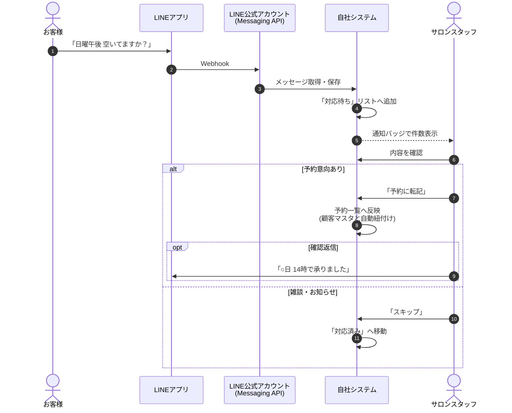
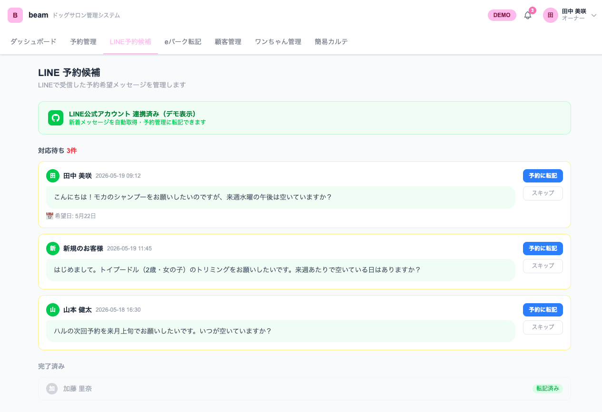

# LINE 連携 — 連携仕様書

> **対象**: ドッグサロン / 美容室 / エステサロン業種テンプレート（demo-builder）
> **用途**: 商談・クライアント説明用
> **デモURL**: https://demo-builder-coral.vercel.app/demo/dogsalon_beam/line

---

## 1. このページでできること（一行要約）

**LINE公式アカウントに届いた「予約希望メッセージ」を一覧で確認し、ワンクリックで予約管理に登録できる。**

---

## 2. なぜ必要か（クライアントへの説明）

ペットサロン・美容室では、お客様が**LINEで気軽に予約相談**を送ってくるケースが急増している。
しかし LINE は本来チャットツールなので、次の問題が起きやすい：

- 営業時間外の問い合わせを**翌朝までに見落とす**
- 複数スタッフでLINEを共有していると**誰が対応中か分からない**
- LINE で予約確定 → 自社の予約管理ノートに**転記漏れ**
- お客様情報が LINE のトーク履歴に埋もれて**カルテと結びつかない**

→ **LINE連携**は、LINEの予約希望メッセージを「予約候補リスト」として可視化し、業務フローに乗せる。

---

## 3. データフロー

### ポイント

| 項目 | 内容 |
|------|------|
| **取込方法** | LINE Messaging API の Webhook をリアルタイム受信 |
| **AI解析（オプション）** | メッセージから希望日・希望時間・メニュー候補を自動抽出 |
| **顧客紐付け** | LINE User ID で固有識別。初回は LINE名 で仮登録 |
| **既読/対応中** | スタッフが対応中であることを他スタッフから見えるように（標準） |

---

## 4. 画面サンプル

### 画面の構成

| 領域 | 役割 |
|------|------|
| **連携ステータスバナー（緑）** | LINE公式アカウント連携の稼働状態 |
| **対応待ち**（赤バッジ） | 未対応の予約候補メッセージ |
| **メッセージ吹き出し** | お客様からの原文を表示 |
| **希望日**（自動抽出） | メッセージ内の日付候補を抽出（オプション機能） |
| **「予約に転記」ボタン** | 1クリックで予約一覧へ反映 |
| **「スキップ」ボタン** | 予約意向なしと判断 → 対応済みへ |
| **完了済み**（下部） | 過去の対応実績 |

---

## 5. ユースケース（業務例）

### ユースケース A: 朝イチで前夜分をまとめて対応

> **8:30** スタッフが出勤
> 「LINE対応待ち 5件」のバッジ
> 1件ずつタップして内容確認・予約転記 or スキップ
> **8:45** までに前夜のLINE全件処理完了

### ユースケース B: 接客中のスマホでサクッと対応

> 施術中にスマホ通知でLINE受信
> 手が空いたタイミングでスマホで管理画面を開き「予約に転記」
> 接客中でも片手で完結

### ユースケース C: 新規顧客の自動マスタ登録

> 「はじめまして、トイプードルの○○です」というLINEメッセージ
> 「予約に転記」をタップ
> → 新規顧客マスタが自動作成され、LINE名で仮登録
> → 来店時に氏名・電話・住所を追記して完了

### ユースケース D: 過去のLINE履歴から接客に活用

> 顧客詳細ページを開くと、過去のLINE履歴も一覧表示（オプション）
> 「以前のメッセージで○○とおっしゃっていましたね」
> → 接客の質が上がる

---

## 6. 設定例（導入の流れ）

### 1) LINE Developers でチャネル作成
- [LINE Developers Console](https://developers.line.biz/) にログイン
- プロバイダー → 新規チャネル → 「Messaging API」を選択
- 公式アカウントを発行（または既存と連携）

### 2) Webhook URL を設定
- demo-builder 管理画面で発行される URL を LINE側に設定
- 例: `https://demo-builder-coral.vercel.app/api/webhook/line/[salonID]`
- 「メッセージ受信」イベントをON

### 3) demo-builder 側にチャネルアクセストークンを登録
- 管理画面 → 連携設定 → LINE
- チャネルアクセストークン、チャネルシークレットを入力

### 4) テストメッセージで動作確認
- スマホからお店のLINE公式アカウントにメッセージ送信
- 管理画面の「対応待ち」に表示されるか確認

### 5) スタッフ運用ルール策定
- 営業時間外の問い合わせは翌朝対応 / 当日対応の方針
- 対応漏れ防止のチェックタイミング（始業時／昼／閉店時）
- 返信テンプレート集の準備

---

## 7. できること / できないこと

| ✅ 標準で可能 | ⚠ オプション / カスタム |
|---------------|----------------------|
| LINE公式アカウント宛メッセージのリアルタイム取込 | 個人 LINE（公式アカウントでない）からの取込 |
| 「対応待ち」リスト管理 | LINE上の自動返信ボット（チャットボット） |
| 「予約に転記」「スキップ」のワンクリック処理 | 希望日時の AI 自動抽出（オプション） |
| 顧客マスタへの自動仮登録 | 画像・スタンプの内容解析 |
| 過去LINE履歴の顧客詳細での表示 | 通話・ビデオ通話の予約管理 |
| 複数スタッフでの対応中ロック | 既読／未読の自動切替（LINE API制約） |

---

## 8. 運用上の注意

- LINE Messaging API は**月間メッセージ数の上限**あり（プランによる）
- 「対応待ち」が溜まりすぎないよう、定期的に確認するルールが必要
- お客様への返信は LINE 公式アカウント アプリから行うのが基本（システム連動オプションも可）
- LINE API の仕様変更時はシステム側もメンテナンスが必要（運用契約推奨）

---

## 9. よくある質問

**Q. LINE公式アカウントがまだないのですが、申込から始まりますか？**
A. はい。LINE公式アカウントの開設（無料プランあり）が前提です。導入支援も可能。

**Q. お客様のLINE名と本名が違う場合、どう紐付けますか？**
A. 初回は LINE名で仮登録 → 来店時に本名・電話を聞いて顧客マスタに統合します。電話番号での名寄せ機能あり。

**Q. 営業時間外に届いたメッセージへの自動返信はできますか？**
A. LINE公式アカウントの標準機能で可能です。本システムとは独立して設定してください。

**Q. 既存の予約電話を完全にLINEに置き換えられますか？**
A. 推奨しません。電話・LINE・予約サイトの**3チャネル併用**が最も予約取りこぼしが少ないというデータがあります。本システムはこれら全てを統合管理できます。

---

## 10. 拡張・将来オプション

- **AI予約抽出**: メッセージから「○月○日 14時 シャンプー希望」を自動抽出してプレフィル
- **LINE Pay 連携**: LINE上で前払い決済を完結
- **リッチメニュー**: LINEアプリ下部に「予約する／変更／キャンセル」ボタン設置
- **セグメント配信**: 顧客タグに応じたキャンペーンメッセージ一斉送信
- **会話ログのカルテ転記**: LINEのやり取りから来店時の特記事項を自動メモ化
